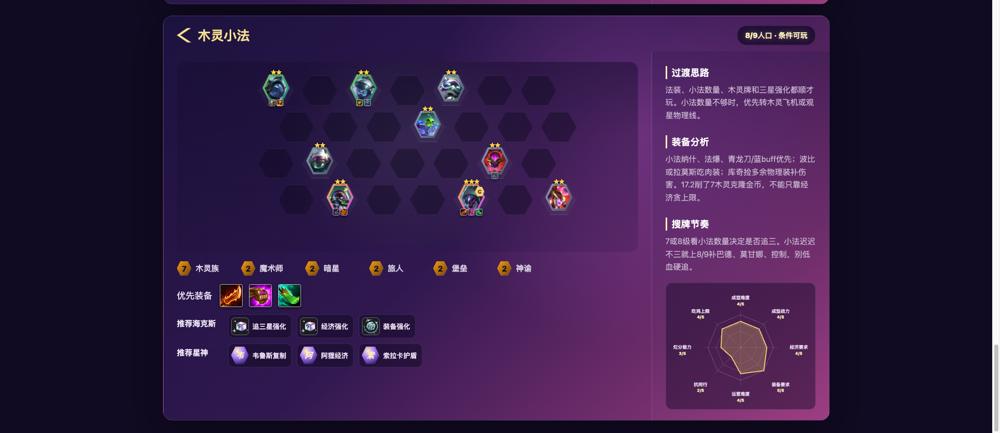

# JCC Meta Researcher

金铲铲之战当前版本阵容研究 Skill。它是一个通用的 Agent Skill 包：核心由 `SKILL.md`、Markdown 知识库和 Python 渲染脚本组成，不绑定特定模型或客户端。Codex、Claude Code、OpenClaw、Hermes 等支持“本地技能 / 自定义指令 / 工具脚本”的 Agent 宿主都可以安装或适配使用。

## 安装

推荐方式：把 GitHub 仓库地址发给你的 Agent，让 Agent 按当前宿主的规则安装。

给 Agent 的安装指令示例：

```text
请从这个 GitHub 仓库安装 jcc-meta-researcher skill：
https://github.com/Waterelement23/jcc-skills

仓库 SSH 地址：
git@github.com:Waterelement23/jcc-skills.git

要求：
1. 获取仓库里的 jcc-meta-researcher/ 目录。
2. 按当前宿主的 skill 目录规则安装。
3. 确保入口文件是 jcc-meta-researcher/SKILL.md。
4. 安装后确认 references/、scripts/、assets/ 都在同一个 skill 目录下。
```

如果 Agent 需要明确目标目录，可以补一句：

```text
请安装到 <your-skill-home>/jcc-meta-researcher，并把 <your-skill-home>/jcc-meta-researcher/SKILL.md 注册为 skill 入口。
```

Codex 常见目标目录：

```text
~/.codex/skills/jcc-meta-researcher
```

不同宿主的目录和注册方式可能不同，因此让宿主内的 Agent 自动处理更稳。这个仓库只要求安装后的目录结构保持 `jcc-meta-researcher/SKILL.md`、`references/`、`scripts/`、`assets/` 不变。

## 演示效果

### Prompt：推荐当前版本阵容

```text
[$jcc-meta-researcher] 推荐几个金铲铲当前版本强势阵容
```

输出会先复核本地知识库和官方版本状态，再按强度分层给出阵容：

```text
当前知识库版本：S17 星神 17.2
联网复核结果：已确认 2026-04-30 17.2 更新公告

高置信推荐
1. 观星狙95 / 观星烬95
   适合：物理装多，观星开局好，血量经济健康，能上9。
   装备：霞羊刀+海妖/巨杀/破防；烬无尽+杀人剑/轻语；努努肉装。
   节奏：4-2上8小D稳血，9级大D烬/巴德/高费二星。
   一句话：17.2观星者和烬增强，仍是最值得练的后期答案之一。

2. 木灵飞机
   适合：库奇物理装成型，木灵/前排来得顺，想稳分兼顾吃鸡。
   装备：库奇轻语+杀人剑+破防；锐雯饮血+泰坦+血手。
   节奏：8级找库奇、锐雯、拉莫斯二星，全员关键二星后上9。
   一句话：17.2库奇、米利欧、纳尔增强，5木灵飞机更可靠。

3. 重装妖姬
   适合：法装开，羊刀/法爆/大天使方向明确，8级能大D四费二星。
   装备：妖姬羊刀+法爆+大天使；努努狂徒+冰甲+冕卫。
   节奏：4-1或4-2拉8大D，体系四费二星再停。
   一句话：二星妖姬线还能玩，但不要把追三当唯一赢法。

有争议可玩
- 新星九五：上限高，但更吃经济、转职、血量和高费二星质量。
- 木灵小法：法装、小法数量和三星强化充足时可玩，不建议强玩。
```

### Prompt：生成网页阵容报告

```text
[$jcc-meta-researcher] 用网页展示你刚刚推荐的阵容
```

Skill 会把推荐阵容整理成结构化 JSON，并调用渲染器生成 HTML：

```bash
python3 jcc-meta-researcher/scripts/render_comp_report.py \
  --input jcc-meta-researcher/generated/s17_17_2_recommended_comps.json \
  --output jcc-meta-researcher/generated/s17_17_2_recommended_comps.html
```

HTML 页面效果：



## 功能

- 当前版本复核：回答阵容推荐前，先检查本地知识库版本，并要求联网确认官方版本或热补丁是否变化。
- 阵容分层推荐：按 `高置信推荐`、`有争议可玩`、`观察名单`、`已削弱 / 不推荐` 输出。
- 详细阵容卡：覆盖适合条件、不推荐条件、成型阵容、站位、装备、海克斯、D 牌、拉人口、多维评分和一句话判断。
- 本地知识库：用 Markdown 保存赛季信息、版本变化、阵容卡和更新日志，便于维护与审计。
- 网页阵容报告：通过 `scripts/render_comp_report.py` 把结构化阵容 JSON 渲染为 HTML，包含棋盘、羁绊、装备、海克斯、星神和雷达评分。

## 兼容性

这个项目的可移植部分是：

- `jcc-meta-researcher/SKILL.md`：给 Agent 读取的能力说明、触发条件和工作流。
- `jcc-meta-researcher/references/`：本地 meta 知识库。
- `jcc-meta-researcher/scripts/`：可由任意宿主调用的 Python 脚本。
- `jcc-meta-researcher/assets/`：网页报告模板和示例数据。

不同宿主的差异只在“如何发现这个 skill”和“如何暴露脚本执行能力”。只要宿主能做到下面几点，就可以使用：

1. 让 Agent 读取 `jcc-meta-researcher/SKILL.md`。
2. 允许 Agent 读取 `references/` 下的 Markdown 文件。
3. 允许 Agent 在需要更新知识库时写入 `references/`。
4. 允许执行 `python3 jcc-meta-researcher/scripts/render_comp_report.py` 生成网页报告。
5. 当前版本阵容推荐需要联网复核官方公告；如果宿主禁用联网，应按 skill 规则声明“未完成联网版本复核”。

## 目录结构

```text
jcc-meta-researcher/
  SKILL.md                         # Skill 入口和工作流说明
  agents/openai.yaml               # Agent 展示名、简介和默认提示词
  references/
    current-version.md             # 本地知识库当前版本状态
    season-overview.md             # 赛季级稳定信息
    update-log.md                  # 知识库更新记录
    versions/                      # 版本级 meta 摘要
    comps/                         # 阵容卡
  scripts/render_comp_report.py    # 阵容网页渲染器
  assets/report_template.html      # HTML 模板
  assets/sample_woodling_corki.json
tests/
  test_render_comp_report.py       # 渲染器回归测试
```

## 结构化阵容 JSON

渲染器接受单个阵容对象，或包含 `comps` 数组的聚合对象。最小结构参考：

```json
{
  "comps": [
    {
      "name": "木灵飞机",
      "stage": "后期成型 · 8人口",
      "traits": [{"count": 5, "name": "木灵族"}],
      "priority_items": [{"name": "最后的轻语", "alt": "轻语", "icon": "https://..."}],
      "augments": [{"name": "经济强化", "icon": "https://..."}],
      "gods": [{"name": "阿狸经验", "short": "阿"}],
      "notes": {
        "过渡思路": "前期稳血上8。",
        "装备分析": "优先做主C输出装。",
        "搜牌节奏": "4-2拉8启动。"
      },
      "ratings": {
        "成型难度": 3,
        "成型战力": 4,
        "经济要求": 4,
        "装备要求": 4,
        "运营难度": 3,
        "抗同行": 3,
        "烂分能力": 4,
        "吃鸡上限": 4
      },
      "board": {
        "rows": [[null, null, null, null, null, null, null]]
      }
    }
  ]
}
```

完整示例见 `jcc-meta-researcher/assets/sample_woodling_corki.json`。

## 维护知识库

每次回答当前版本阵容前，skill 都应：

1. 读取 `references/current-version.md`。
2. 联网检查官方版本公告或热补丁状态。
3. 如果版本变化，更新 `current-version.md`、`references/versions/<version>.md` 和受影响的 `references/comps/*.md`。
4. 在 `references/update-log.md` 追加更新记录。
5. 明确区分官方事实和阵容强度判断。

推荐来源优先级：

1. 官方公告、腾讯相关发布渠道、官方更新说明。
2. 主流阵容榜和攻略站的多源共识。
3. 视频和社区内容只作为辅助证据。
4. 模型推理只能解释影响，不应单独作为高置信推荐依据。

## 测试

运行全部测试：

```bash
python3 -m unittest
```

当前测试重点覆盖 HTML 渲染器：

- 页面包含阵容标题、装备、海克斯、星神和雷达图。
- 棋盘使用当前赛季方形头像。
- 装备使用真实图标。
- 棋盘不直接显示单位名称，但保留 `title` 和 `alt` 便于访问性与悬停查看。

## 注意事项

- 这个项目不是官方工具，阵容结论来自官方改动和多源攻略交叉验证。
- 当前版本和阵容强度会随热补丁变化，GitHub 仓库中的知识库可能滞后；使用前应按 `SKILL.md` 工作流联网复核。
- 不要把单一攻略源直接标为 T0；来源分歧时应保留不确定性。
- 不承诺稳定上分或必吃鸡，低血、低经济、装备不匹配、同行过多时应按局势转阵。
